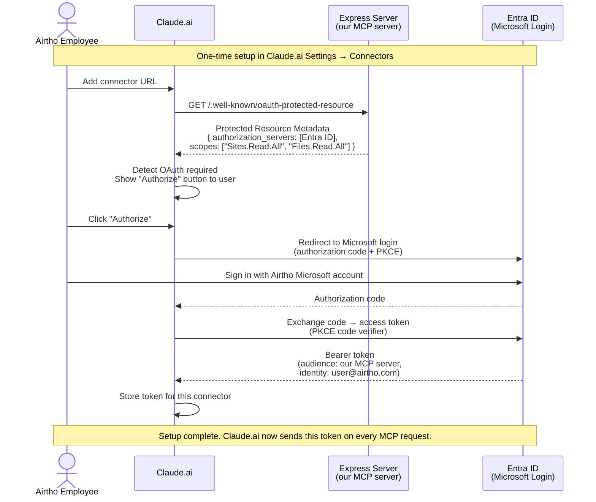
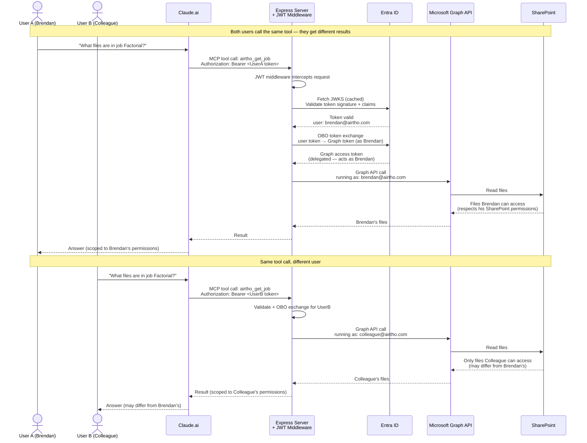

# After: Express + MCP SDK with OAuth 2.1 + OBO (Proposed)

## First-Time Setup Flow (Once Per User)

## Tool Call Flow (After Auth Setup)

## What changes

- **Authentication:** Every Claude.ai user authenticates individually with their Microsoft account. One-time setup.
- **Authorization:** SharePoint permissions are fully respected per user.
- **Audit trail:** Graph API calls carry the user's identity — appear in Entra ID sign-in logs and SharePoint audit logs.
- **Per-user SharePoint permissions:** Fully enforced via OBO delegated token exchange.
- **Token flow:** Each request has its own Graph token tied to the requesting user.
