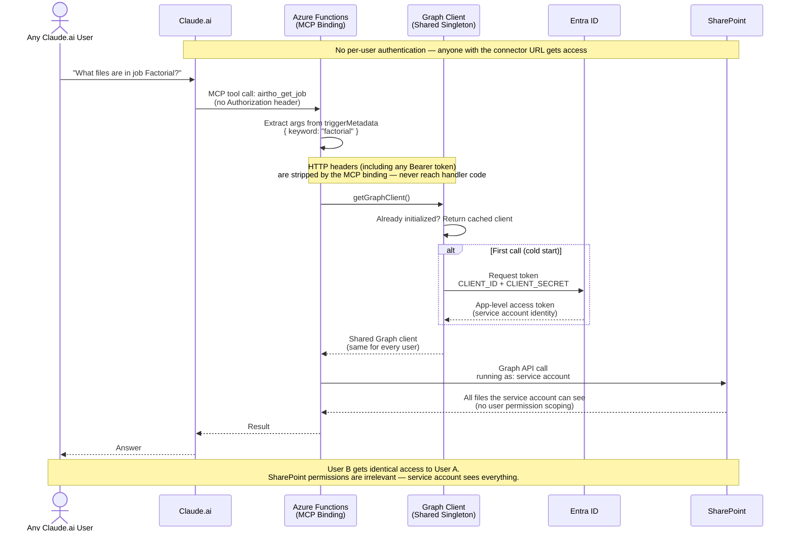

# Before: Azure Functions Native MCP Binding (Current)

## Tool Call Flow

## What this means

- **Authentication:** None. The MCP endpoint is protected only by the Azure Functions system key in the URL.
- **Authorization:** The service account's SharePoint permissions apply to every user.
- **Audit trail:** No way to tell which Claude.ai user accessed what.
- **Per-user SharePoint permissions:** Not possible — Graph calls are always the service account.
- **Token flow:** One `ClientSecretCredential` singleton shared for the entire function worker lifetime.
